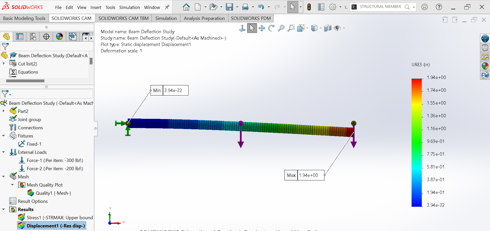
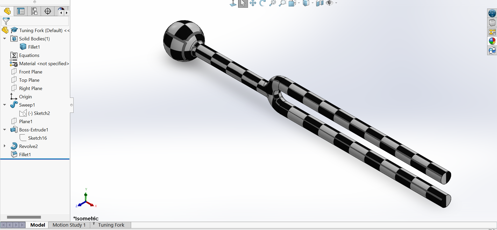
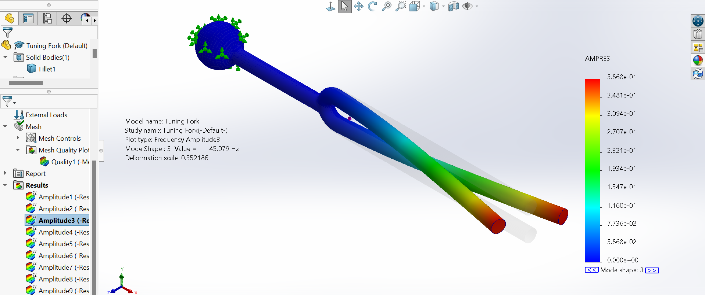

<h1 align="center" style="font-size100px;">🔧 SOLIDWORKS</h1>


# Beam Deflection Study – Finite Element Analysis (FEA)

## 1. Introduction and Objective

This project investigates the vertical deflection behavior of a cantilever beam subjected to two concentrated loads using both **classical beam theory (hand calculations)** and **Finite Element Analysis (FEA)** in **SOLIDWORKS Simulation**. The primary objective is to validate the analytical solution using superposition against numerical simulation results and to demonstrate how FEA can be used as a reliable engineering tool for predicting structural response.

This study answers:

* What was analyzed
* Why the analysis matters
* What the results mean
* How confident we are in the conclusions

---

## 2. Problem Description

### 2.1 Beam Geometry and Material


* **Beam type:** Cantilever beam (fixed at one end, free at the other)
* **Material:** 7079 Aluminum
* **Young’s Modulus (E):**

```text
E = 10.4 × 10^6 psi
```

* **Outside Diameter:** 2.0 in
* **Inside Diameter:** 1.5 in
* **Area Moment of Inertia (I):**

```text
I = 0.5369 in^4
```

The beam is modeled as a hollow circular tube, which is commonly used in lightweight structural applications due to its high stiffness-to-weight ratio.

---

### 2.2 Loading and Boundary Conditions

* The beam is **fully fixed at point O**, meaning it cannot translate or rotate.
* Two vertical downward point loads are applied:

```text
Load at A = 300 lbf (downward)
Load at B = 200 lbf (downward)
```

* Locations:

```text
Distance O → A = 2 ft = 24 in
Distance O → B = 4 ft = 48 in
```

---

## 3. Analytical (Hand) Calculation

### 3.1 Methodology

The analytical solution is based on **Euler–Bernoulli beam theory** and the **principle of superposition**. Because the beam remains within the elastic range and deformations are small, the total deflection at point B can be found by summing the individual deflections caused by each load acting independently.

---

### 3.2 Governing Equation

```text
y_B = - (F_B * l^3) / (3 * E * I)
      + (F_A * a^2) / (6 * E * I) * (a - 3 * l)
```

Where:

```text
F_B = load applied at point B
F_A = load applied at point A
l   = total beam length
a   = distance from fixed end to point A
E   = Young’s Modulus
I   = Area Moment of Inertia
```

---

### 3.3 Substitution of Values

```text
y_B = [ -200 * (4 * 12)^3 ] / [ 3 * (10.4 × 10^6) * (0.5369) ]
      + [ 300 * (2 * 12)^2 ] / [ 6 * (10.4 × 10^6) * (0.5369) ]
        * [ (2 * 12) - 3 * (4 * 12) ]
```

---

### 3.4 Analytical Result




```text
Deflection at point B ≈ -1.94 inch
```

The negative sign indicates **downward deflection**, consistent with the direction of the applied loads.

---

## 4. Finite Element Analysis (FEA)

### 4.1 Software and Tools Used

```text
CAD & Simulation Software : SOLIDWORKS Simulation
Study Type                : Static Structural Analysis
Element Type              : Beam Elements
Solver                    : Linear Static Solver
```

These tools allow the beam to be discretized into finite elements, enabling numerical approximation of the governing equations of elasticity.

---

### 4.2 FEA Model Setup

* Geometry identical to analytical model
* Material assigned as 7079 Aluminum
* Fixed constraint applied at point O
* Point loads applied:

```text
300 lbf at point A
200 lbf at point B
```

* Adequate mesh refinement to ensure convergence and numerical accuracy

---

## 5. Results and Interpretation

### 5.1 Displacement Results

```text
Maximum displacement ≈ 1.94 in (at point B)
Minimum displacement ≈ 0 in (at fixed end)
```

The deformation plot exhibits smooth curvature, which is characteristic of bending-dominated cantilever behavior.

---

### 5.2 Comparison Between Analytical and FEA Results

```text
-----------------------------------------
Method              | Deflection at B (in)
-----------------------------------------
Hand Calculation    | 1.94
FEA (SOLIDWORKS)    | 1.94
-----------------------------------------
```

The strong agreement confirms:

* Correct analytical formulation
* Proper boundary conditions and loading in FEA
* Validity of linear elastic assumptions

---

## 6. Significance of the Study

This study demonstrates how **classical engineering theory and modern simulation tools complement one another**:

* Hand calculations provide physical insight and validation
* FEA provides visualization, scalability, and design flexibility

For non-technical stakeholders, this confirms:

* Predictable structural behavior
* Trustworthy simulation results
* Reduced design and safety risk

---

## 7. Engineering Insights and Observations

* Maximum deflection occurs at the free end, as expected
* The beam remains within the elastic range
* The hollow circular section provides excellent stiffness-to-weight efficiency

---

## 8. Applications of This Beam Configuration

Common applications include:

```text
• Aerospace structural members
• Robotic arms and manipulators
• Cantilevered signposts
• Lightweight structural frames
• Automotive and motorsport components
```

Deflection control in these systems is critical for alignment, performance, and safety.

---

## 9. Recommendations and Future Work

```text
• Perform stress and factor-of-safety analysis
• Optimize wall thickness and material selection
• Investigate dynamic and fatigue loading
• Study nonlinear behavior for large deflections
```

---

## 10. Conclusion

This beam deflection study successfully validates analytical predictions using Finite Element Analysis. The near-perfect agreement between theory and simulation confirms the accuracy of the model and highlights the importance of combining first-principles engineering with modern computational tools. The study provides a robust foundation for future structural design and optimization efforts.

---

# Tuning Fork – Natural Frequency (Modal) Analysis

**SOLIDWORKS Simulation – Frequency Study**  
**Study name:** Tuning Fork  
**Analysis type:** Frequency (Modal analysis)

---

## 📖 Project Overview

This project performs a **modal analysis** (natural frequency study) on a tuning fork geometry created in SOLIDWORKS. The simulation calculates the first 10 natural frequencies, corresponding mode shapes, and mass participation factors to understand the dynamic vibration behavior of the tuning fork. The model represents a classic tuning fork with a spherical handle and two prongs, commonly used in acoustics, physics education, and medical diagnostics.

---

## 🎯 Objectives

1. Determine the first 10 natural frequencies of the tuning fork  
2. Identify the dominant vibration modes (bending, torsion, longitudinal, etc.)  
3. Evaluate mass participation in X, Y, Z directions to understand which directions are most excitable  
4. Verify the characteristic closely spaced bending modes typical of tuning forks  
5. Provide reliable simulation data for educational purposes or design verification  
6. Create a foundation for future studies (harmonic response, forced vibration, material changes)

---

## 🛠️ Software & Study Settings

- **Software**: SOLIDWORKS Simulation  
- **Study name**: Tuning Fork  
- **Analysis type**: Frequency  
- **Mesh type**: Solid Mesh  
- **Number of frequencies**: 10  
- **Solver**: FFEPlus  
- **Soft Spring**: Off  
- **Decouple mixed free body modes**: Off  
- **Incompatible bonding options**: Automatic  
- **Thermal option**: Include temperature loads  
- **Zero strain temperature**: 298 K  
- **Fluid pressure effects**: Off  

**Units**  
- System: SI (MKS)  
- Length / Displacement: mm  
- Temperature: Kelvin  
- Stress / Pressure: N/m²  

---

## 🔧 Mesh Information

| Property                              | Value              |
|---------------------------------------|--------------------|
| Mesher used                           | Blended curvature-based |
| Jacobian points                       | 16 points          |
| Max element size                      | 8.94536 mm         |
| Min element size                      | 2.98176 mm         |
| **Total nodes**                       | **23 344**         |
| **Total elements**                    | **14 258**         |
| Maximum aspect ratio                  | 5.1756             |
| % elements with aspect ratio < 3      | **100%**           |
| % elements with aspect ratio > 10     | 0%                 |
| % distorted elements                  | 0%                 |
| Meshing time                          | 13 seconds         |

**Mesh quality**: Excellent – high-quality mesh with very good element shapes.

---

## 📊 Results – Natural Frequencies

| Mode | Frequency (rad/s) | Frequency (Hz) | Period (s)    |
|------|-------------------|----------------|---------------|
| 1    | 110.21            | **17.54**      | 0.057011      |
| 2    | 110.67            | **17.613**     | 0.056777      |
| 3    | 283.24            | 45.079         | 0.022183      |
| 4    | 292.96            | 46.626         | 0.021447      |
| 5    | 839.6             | 133.63         | 0.0074835     |
| 6    | 841.53            | 133.93         | 0.0074664     |
| 7    | 1 483.7           | 236.13         | 0.0042349     |
| 8    | 1 829.3           | 291.14         | 0.0034348     |
| 9    | 2 411.4           | 383.78         | 0.0026056     |
| 10   | 2 420.6           | 385.25         | 0.0025957     |

**Key observation**: Modes 1 and 2 are extremely close (17.54 Hz and 17.613 Hz) — this is the classic **near-degenerate pair** of symmetric and antisymmetric bending modes that produce the characteristic pure tone of a tuning fork.

---

## 📈 Mass Participation (Normalized)

| Mode | Frequency (Hz) | X direction   | Y direction   | Z direction   |
|------|----------------|---------------|---------------|---------------|
| 1    | 17.54          | ~0            | ~0            | **0.51775**   |
| 2    | 17.613         | ~0            | **0.51655**   | ~0            |
| 5    | 133.63         | ~0            | ~0            | 0.12476       |
| 6    | 133.93         | ~0            | 0.11775       | ~0            |
| 9    | 383.78         | ~0            | 0.035581      | ~0            |
| 10   | 385.25         | ~0            | ~0            | 0.027777      |
| **Sum** | —           | **0.00439**   | **0.66995**   | **0.67043**   |

**Interpretation**:
- Almost all effective mass participates in **Y** and **Z** directions  
- Negligible participation in **X** direction → symmetry of the fork  
- Modes 1 and 2 together capture ~103% of the effective mass in the primary vibration plane (typical for bending-dominated structures)






## 📄 Download Simulation Report

[⬇️ Download PDF](Simulation%20of%20Tuning%20Fork.pdf)

---

## 🧠 Discussion – Main Engineering Insights

- **Fundamental modes (17.54 Hz & 17.613 Hz)**  
  These are the primary bending modes of the two prongs moving in phase and out of phase. The very small frequency difference (~0.4%) is expected and desirable, it produces a clean, sustained tone with minimal beating.

- **Low fundamental frequency**  
  ~17.5 Hz is **much lower** than a standard musical tuning fork (usually 256 Hz, 440 Hz, 512 Hz, etc.). This geometry represents a **large demonstration / physics lab tuning fork** rather than a musical or medical one.

- **Higher modes (133–385 Hz)**  
  Represent higher-order bending, torsional, and longitudinal vibrations — usually not excited during normal use.

- **Mass participation**  
  Strong participation in two perpendicular directions confirms that the fork vibrates mainly in the plane of the prongs, exactly as expected.

---

## ✅ Conclusion

The modal analysis correctly captures the characteristic closely spaced bending modes of a tuning fork at approximately **17.5 Hz**. The results are consistent with classical vibration theory for symmetric fork structures.

The simulation methodology is reliable and can be reused for:
- Musical tuning forks (440 Hz, 512 Hz, etc.)
- Medical tuning forks (128 Hz, 256 Hz)
- Custom resonator designs

---

## 🏭 Real-World Applications

- **Music & Acoustics** — designing tuning forks, tuning bars, vibraphones, glockenspiels  
- **Medical Diagnostics** — neurological examination forks (128 Hz, 256 Hz)  
- **Physics Education** — classroom demonstrations of vibration modes and resonance  
- **Precision Instruments** — tuning fork sensors, frequency standards, quartz tuning forks in watches  
- **MEMS Devices** — tuning fork gyroscopes, resonators in accelerometers and timing devices  
- **Vibration Testing** — reference standards for calibrating vibration equipment

---

## 🚀 Future Work Ideas

- Scale the model to achieve standard musical frequencies (440 Hz, 523 Hz, etc.)  
- Change material (steel → aluminum → quartz) and compare frequency shift  
- Add damping to estimate sound decay time  
- Perform harmonic response analysis with impact loading  
- Include temperature effects on frequency (thermal expansion)  
- Compare simulation with experimental tap test results

---


